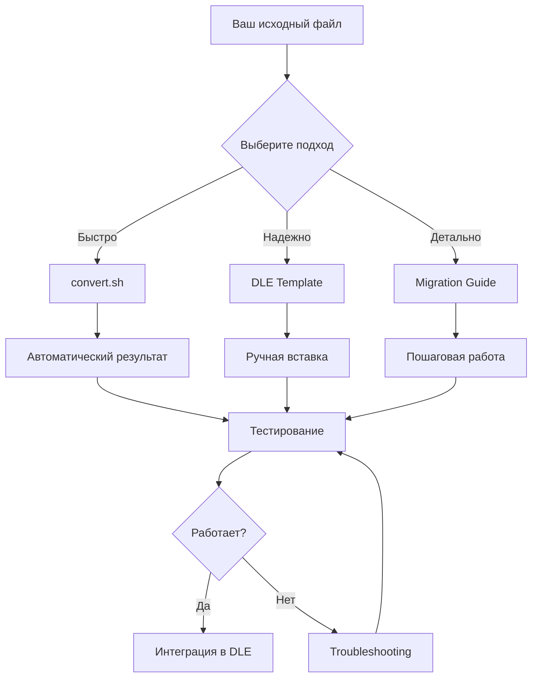

# 📚 Quote Editor - Shadow DOM Isolated Version

## Навигация по проекту

### 🚀 Быстрый старт
- **[QUICK-START.md](QUICK-START.md)** - Начните здесь! 5 минут до результата

### 📖 Документация
- **[README.md](README.md)** - Общая документация, обзор проекта
- **[MIGRATION-GUIDE.md](MIGRATION-GUIDE.md)** - Детальная инструкция миграции (60 мин)

### 🔧 Инструменты
- **[convert.sh](convert.sh)** - Bash скрипт автоматической конвертации
- **[convert-to-shadow.js](convert-to-shadow.js)** - Node.js скрипт конвертации

### 📄 Шаблоны и примеры
- **[dle-integration-template.html](dle-integration-template.html)** - Готовый шаблон для DLE
- **[example-usage.html](example-usage.html)** - Рабочий пример использования

### 📁 JavaScript модули
- **[js/shadow-adapter.js](js/shadow-adapter.js)** - Адаптер для Shadow DOM
- **[js/quote-editor-wrapper.js](js/quote-editor-wrapper.js)** - Обертка приложения

---

## Структура директорий

```
isolated-quote-editor/
├── INDEX.md                        ← Вы здесь
├── QUICK-START.md                  ← Начните отсюда!
├── README.md                       ← Общая документация
├── MIGRATION-GUIDE.md              ← Детальная инструкция
│
├── convert.sh                      ← Bash конвертер
├── convert-to-shadow.js            ← Node.js конвертер
│
├── dle-integration-template.html   ← Готовый шаблон для DLE
├── example-usage.html              ← Рабочий пример
│
├── js/
│   ├── shadow-adapter.js           ← Адаптер Shadow DOM
│   └── quote-editor-wrapper.js     ← Обертка приложения
│
├── css/
│   └── (место для extracted стилей)
│
└── templates/
    └── (место для extracted HTML)
```

---

## 🎯 Какой документ читать?

### Если у вас есть 5 минут
→ [QUICK-START.md](QUICK-START.md)

### Если нужна полная инструкция
→ [MIGRATION-GUIDE.md](MIGRATION-GUIDE.md)

### Если хотите понять концепцию
→ [README.md](README.md)

### Если нужен готовый шаблон
→ [dle-integration-template.html](dle-integration-template.html)

### Если нужна автоматизация
→ [convert.sh](convert.sh)

---

## 📊 Сравнение подходов

| Подход | Время | Автоматизация | Контроль | Рекомендуется |
|--------|-------|---------------|----------|---------------|
| **Скрипт convert.sh** | 1 мин | ✅ Полная | ⚠️ Средний | Для первой попытки |
| **Шаблон DLE** | 15 мин | ❌ Ручная | ✅ Полный | Для продакшена |
| **Пошаговая миграция** | 60 мин | ❌ Ручная | ✅ Максимальный | Для глубокого понимания |

---

## 🔄 Рекомендуемый workflow



---

## ✅ Чек-лист готовности

Перед началом убедитесь:

- [ ] У вас есть оригинальный файл Quote Editor
- [ ] Установлен bash (для convert.sh) или Node.js (для convert-to-shadow.js)
- [ ] Есть доступ к DLE шаблонам
- [ ] Есть возможность тестировать на локальном сервере

---

## 🆘 Помощь и поддержка

### Где искать решения:

1. **Ошибки инициализации** → [README.md#troubleshooting](README.md#troubleshooting)
2. **Проблемы с селекторами** → [MIGRATION-GUIDE.md#шаг-4](MIGRATION-GUIDE.md#шаг-4-адаптация-javascript-20-минут)
3. **Изоляция не работает** → [README.md#проблема-стили-не-применяются](README.md#проблема-стили-не-применяются)

### Проверочные команды:

```bash
# Проверить количество замен
grep -c "QE.get(" your-file.js

# Найти оставшиеся document.getElementById
grep "document\.getElementById" your-file.js

# Проверить наличие shadowRoot
grep -c "shadowRoot" your-file.js
```

---

## 📈 Версии и обновления

- **v1.0** - Первая версия с Shadow DOM
  - Полная изоляция стилей
  - Адаптированные селекторы
  - API для внешнего доступа

---

## 📝 Лицензия

MIT License - используйте свободно в ваших проектах

---

## 🌟 Дополнительные ресурсы

- [MDN: Shadow DOM](https://developer.mozilla.org/en-US/docs/Web/Web_Components/Using_shadow_DOM)
- [Web Components](https://www.webcomponents.org/)
- [DLE Documentation](https://dle-news.ru/)

---

**Создано с ❤️ для безопасной интеграции в DLE**

*Последнее обновление: 2025-11-08*
